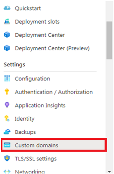
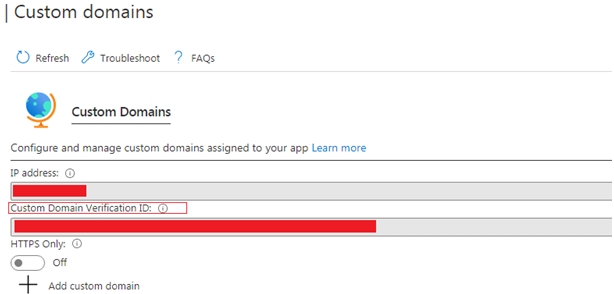

# Introduction

The purpose of this document is to make sure that the ownership of custom domains that you wish to add within an App-Service should be verified by your domain provider(such as GoDaddy).

## Steps to get the verification ID from Azure
- Login to the Azure Portal
- Search and select the required App-Service
- Select --> Custom Domains


- Copy the Custom Domain Verification ID into your buffer



## Steps to configure the Azure Verification ID in the DNS entry for your Domain Provider
- Login to your Custom Domain provider
- Change the DNS configuration of the domain
    - The DNS configuration of the domain-->
    - Add new record
    - Type : TXT
    - Name: asuid
    - Content/value: Custom Domain Verification ID (Paste the Azure verification ID from your buffer)

## Failing to configure ownership of the custom domain with your domain provider will produce the following error

```
Error creating/updating Custom Hostname Binding <your_domain_name> (App Service <App_Service_Name> / Resource Group <Resource_Group_Name>): web.AppsClient#CreateOrUpdateHostNameBinding: Failure responding to request: StatusCode=400 -- Original Error: autorest/azure: Service returned an error. Status=400 Code="BadRequest" Message="A TXT record pointing from asuid.<your_domain_name> to <Azure_Verification_ID> was not found." 
```
